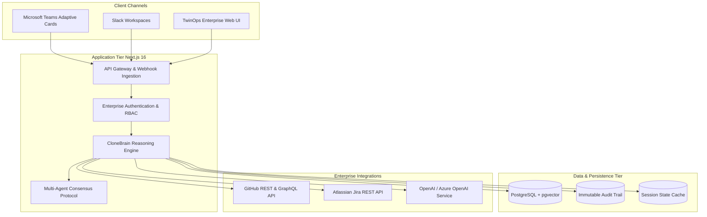

# TwinOps Enterprise

Autonomous workplace digital twins and multi-agent coordination platform for enterprise engineering delivery pods.

## 1. Project Overview

TwinOps is an enterprise orchestration platform that builds specialized digital twin agents for engineering leads, architects, and product managers. These digital twins represent team leads when they are unavailable, answering technical and procedural queries across enterprise communication channels such as Microsoft Teams and Slack.

The system connects directly to enterprise systems of record—including GitHub, Jira, and Confluence—and indexes organizational decisions into an encrypted PostgreSQL vector database. When queried, agents synthesize answers grounded in verifiable enterprise artifacts, complete with citations, confidence scores, and human-in-the-loop escalation paths for high-risk actions.

### Core Problems Addressed
- Technical leadership bottlenecks during multi-hour client meetings or time-zone handoffs.
- Fragmented project context scattered across Jira tickets, pull requests, and chat threads.
- Inability of generic public LLMs to access private enterprise code repositories and sprint artifacts securely.

---

## 2. Architecture

TwinOps is built as a modular system comprising an API gateway, agent reasoning engine, memory mesh, and enterprise integration connectors.



### Component Communication
1. **Client Channels to Gateway**: Inbound requests arrive via HTTPS POST webhooks from Microsoft Teams (Adaptive Cards) or Slack event subscriptions, or via authenticated Next.js API routes from the Web UI.
2. **Gateway to Brain**: Requests undergo payload verification, rate-limiting, and tenant isolation before being passed to `CloneBrain`.
3. **Brain to Vector Store**: The reasoning loop queries PostgreSQL using `pgvector` hybrid search (HNSW cosine similarity combined with TSVector keyword matching).
4. **Brain to Enterprise APIs**: Tool invocations (e.g., retrieving pull requests or checking Jira ticket statuses) run through sandboxed connector interfaces enforcing least-privilege permissions.
5. **Multi-Agent Consensus**: If an inquiry spans multiple domains (e.g., architectural design impacting infrastructure compliance), the primary agent initiates a structured peer consultation with specialized agent pods.

---

## 3. Technology Stack

- **Framework**: Next.js 16.1.6 (App Router, Server Actions, Route Handlers)
- **Runtime & Language**: Node.js 20+ LTS, TypeScript 5 (Strict Mode)
- **UI & Styling**: React 19, Tailwind CSS 4, Lucide React icons
- **Database & Vectors**: PostgreSQL with `pgvector` (Supabase Cloud or self-hosted)
- **AI & Reasoning**: OpenAI GPT-4o / Azure OpenAI Service via OpenAI SDK
- **Testing**: Node.js native test runner executed via `tsx`
- **Integrations**: Microsoft Teams Adaptive Cards v1.4, GitHub REST API, Atlassian Jira Cloud REST API

---

## 4. Repository Structure

```
.
├── .github/
│   └── workflows/
│       └── ci.yml               # GitHub Actions CI pipeline (lint, test, build, secrets)
├── app/                         # Next.js App Router
│   ├── (app)/                   # Authenticated application views (dashboard, clones, settings)
│   ├── api/                     # REST API routes and webhook receivers
│   │   ├── chat/                # Interactive conversational streaming endpoint
│   │   ├── github/              # GitHub repository synchronization
│   │   ├── integrations/        # Channel status and configuration verification
│   │   ├── memory/              # Vector search and memory compaction
│   │   └── twinops/             # Digital twin management and document ingestion
│   └── page.tsx                 # Root application entrypoint
├── backend/
│   └── memory/                  # Database repository, vector search, and cache layer
├── components/                  # React UI components
│   ├── chat/                    # Chat window, message bubbles, and collaboration panel
│   ├── dashboard/               # Agent status cards, logs, and activity telemetry
│   ├── layout/                  # Navigation headers and enterprise sidebars
│   └── twinops/                 # Network visualization and channel simulator
├── docs/                        # Enterprise technical documentation
│   ├── agent-architecture.md   # Multi-agent coordination, tools, and guardrails
│   ├── architecture.md         # System components and data flow
│   ├── deployment.md           # Docker, Kubernetes, and Vercel deployment guides
│   ├── development.md          # Local developer setup, branching, and PR guidelines
│   ├── integrations.md         # Connector architecture and configuration guides
│   └── security.md             # Threat modeling, secrets, prompt injection defense
├── lib/
│   ├── agents/                  # CloneBrain orchestrator and multi-agent collaboration
│   ├── core/                    # Supabase database clients, chunkers, and core types
│   ├── integrations/            # Connectors (Teams, Slack, GitHub, Jira, Notion)
│   ├── memory/                  # Search indexing and memory extraction logic
│   └── twinops/                 # Enterprise API client abstractions
├── supabase/
│   ├── migrations/              # PostgreSQL DDL and pgvector indexes
│   └── seed.sql                 # Baseline schema seeds for system agents
├── tests/                       # Unit and integration test suite
│   ├── agent-brain.test.mjs
│   ├── integrations.test.mjs
│   ├── memory-repository.test.mjs
│   └── security-boundaries.test.mjs
└── package.json                 # Dependency manifests and automation scripts
```

---

## 5. Local Development

### 1. Clone the Repository
```bash
git clone git@github.com:mohammadali-2000/twinops-enterprise.git
cd twinops-enterprise
```

### 2. Install Dependencies
```bash
npm ci
```

### 3. Configure Environment Variables
```bash
cp .env.example .env.local
```
Edit `.env.local` with your database and model provider credentials. Refer to the Configuration section below.

### 4. Start the Application
```bash
npm run dev
```
Access the application at `http://localhost:3000`.

### 5. Run Automated Tests
```bash
npm test
```

### 6. Run Linting
```bash
npm run lint
```

### 7. Run Type Checking
```bash
npx tsc --noEmit
```

### 8. Build the Production Bundle
```bash
npm run build
```

---

## 6. Configuration

TwinOps requires configuration via environment variables. Copy `.env.example` to `.env.local` for local execution. Never commit actual secret values to version control.

| Variable | Description | Required | Example |
| :--- | :--- | :--- | :--- |
| `NEXT_PUBLIC_SUPABASE_URL` | Supabase API URL | Yes | `https://xyzcompany.supabase.co` |
| `NEXT_PUBLIC_SUPABASE_ANON_KEY` | Supabase Anonymous Client Key | Yes | `eyJhbGciOi...` |
| `SUPABASE_SERVICE_ROLE_KEY` | Supabase Service Role Key | Yes | `eyJhbGciOi...` |
| `OPENAI_API_KEY` | OpenAI API Key or Azure OpenAI Key | Yes | `sk-proj-...` |
| `OPENAI_MODEL` | Default model identifier | No | `gpt-4o` |
| `TEAMS_WEBHOOK_URL` | Microsoft Teams Power Automate Webhook | No | `https://prod-01.westus.logic.azure.com/...` |
| `GITHUB_ACCESS_TOKEN` | GitHub Personal Access Token | No | `ghp_...` |
| `GITHUB_REPO_OWNER` | Default GitHub organization or username | No | `enterprise-org` |
| `GITHUB_REPO_NAME` | Default GitHub repository name | No | `platform-core` |
| `JIRA_HOST` | Atlassian Jira domain | No | `company.atlassian.net` |
| `JIRA_EMAIL` | Service account email for Jira API | No | `svc-twinops@company.com` |
| `JIRA_API_TOKEN` | Jira Cloud API Token | No | `ATATT3xFfGF0...` |
| `SLACK_BOT_TOKEN` | Slack Bot User OAuth Token | No | `xoxb-...` |
| `SLACK_SIGNING_SECRET` | Slack Webhook Signing Secret | No | `9a8b7c6d...` |

---

## 7. Integrations

The platform features standardized enterprise connectors partitioned into implemented, partially implemented, and planned categories.

| Integration | Status | Implementation Details |
| :--- | :--- | :--- |
| **Microsoft Teams** | Implemented | Dispatches Adaptive Cards v1.4 via Power Automate Webhooks; includes actionable buttons, citation links, and presence indicators. |
| **GitHub** | Implemented | Client implemented in `lib/integrations/github.ts` for pulling pull request diffs, repository commits, and issue descriptions. |
| **Jira** | Partial | Data interfaces defined in `backend/memory/synthetic/jira.ts`; active sync pipeline requires deployment of Jira Cloud webhook credentials. |
| **Slack** | Partial | Event receiver and signature validation implemented in `app/api/slack/events/route.ts`; requires Slack App manifest installation. |
| **Notion** | Partial | Document parser and sync schema implemented in `lib/integrations/notion.ts`; requires internal integration token. |
| **Google Workspace** | Partial | OAuth routing configured in `app/api/auth/google/route.ts`; requires Google Cloud Console Client ID and Secret. |
| **Microsoft Graph API**| Planned | Direct Graph API integration for corporate Outlook calendar presence synchronization and enterprise directory lookup. |

---

## 8. Agent Architecture

### Personas and Pods
- **Architecture Lead Twin**: Answers technical architecture questions, verifies schema standards, and evaluates system dependencies.
- **Security Lead Twin**: Audits code snippets for injection vulnerabilities, flags secret leakage, and checks role-based access control.
- **Data Engineering Twin**: Validates database migrations, pgvector index configurations, and batch ETL pipelines.
- **DevOps Lead Twin**: Tracks CI/CD pipeline states, container deployment configurations, and runtime health alerts.

### Tool Execution Sandbox
Agents have access to typed, schema-validated tools:
- `search_memory`: Queries episodic memory using vector similarity.
- `consult_clone`: Initiates cross-agent consensus requests with recursion depth limits (`MAX_DEPTH = 3`).
- `get_github_pr`: Retrieves pull request context and file diffs.
- `search_jira_issues`: Queries sprint issue backlogs using JQL.

### Security Boundaries
- **No Arbitrary Execution**: Agents cannot execute shell commands or unvalidated database queries.
- **Strict Parameter Validation**: All tool arguments are checked against rigid JSON Schema definitions prior to invocation.
- **Context Isolation**: External untrusted content (e.g., ticket comments, PR bodies) is encapsulated within immutable `<untrusted_external_content>` tags to prevent indirect prompt injection.

---

## 9. Security

### Zero Trust Architecture
- **Secret Redaction**: Environment variables and bearer tokens are automatically stripped from outgoing logs and error objects.
- **Tenant Isolation**: All queries against the memory store are hard-scoped to `tenant_id` and verified user identities.
- **Role-Based Access Control**: Sensitive actions (such as offboarding agent clones or altering organizational memory) require verified enterprise administrator tokens.

### Compliance Considerations
- Designed for HIPAA and SOC2 compliant environments.
- Ingestion pipelines enforce regex and semantic detection of Personally Identifiable Information (PII) and Protected Health Information (PHI) before vectorization.

---

## 10. Development Guidelines

### Branch Strategy
- `main`: Protected production branch. Direct commits are restricted.
- Feature branches: `feat/<ticket-id>-<description>`
- Bugfix branches: `fix/<ticket-id>-<description>`
- Refactor branches: `refactor/<description>`

### Commit Conventions
Commits must follow the Conventional Commits standard:
- `feat(scope): add new capability`
- `fix(scope): resolve bug`
- `refactor(scope): restructure without functional change`
- `security(scope): apply security patch or boundary check`
- `test(scope): add or modify automated tests`
- `docs(scope): update technical documentation`

### Quality Gates
Pull requests must pass the following continuous integration checks:
1. `npm run lint` (0 errors)
2. `npx tsc --noEmit` (0 type errors)
3. `npm test` (all tests passing)
4. `npm run build` (successful production build)

---

## 11. Deployment

TwinOps can be deployed as a serverless application on Vercel Enterprise or as a containerized workload on Kubernetes or AWS ECS.

For containerized deployments, refer to the multi-stage Docker build specification in `docs/deployment.md`.

Database initialization and migrations must be executed against the target PostgreSQL cluster prior to traffic cutover:
```bash
npx supabase db push --db-url "postgresql://[USER]:[PASSWORD]@[HOST]:[PORT]/[DATABASE]"
```

---

## 12. Troubleshooting

### 1. Database Connection Failures
- **Symptom**: `Failed to fetch clones` or `Vector store unconfigured` log notices.
- **Resolution**: Verify `NEXT_PUBLIC_SUPABASE_URL` and `SUPABASE_SERVICE_ROLE_KEY` in `.env.local`. When running without a live database, services gracefully return empty states (`[]`) rather than crashing.

### 2. OpenAI API Rate Limits or Missing Keys
- **Symptom**: HTTP 503 on `/api/twinops/chat` with message `AI model service unconfigured`.
- **Resolution**: Ensure `OPENAI_API_KEY` is present and has active quota. For enterprise Azure OpenAI deployments, configure the appropriate Azure resource endpoint and deployment name.

### 3. Microsoft Teams Adaptive Card Delivery Failures
- **Symptom**: HTTP 400 from Microsoft Power Automate webhook.
- **Resolution**: Ensure the Power Automate workflow is configured to receive an Adaptive Card payload of version 1.4. Verify that `TEAMS_WEBHOOK_URL` uses HTTPS and is reachable from your network.

---

## 13. Project Roadmap

1. **Microsoft Graph Direct Gateway**: Replace webhook-based Teams delivery with a native Microsoft Graph enterprise bot application.
2. **Jira Cloud Two-Way Synchronization**: Implement real-time webhook listeners for Jira sprint updates and story point estimation assists.
3. **Enterprise SSO & SAML**: Add Okta and Microsoft Entra ID authentication providers with automated SCIM user provisioning.
4. **Local LLM Inference Adapter**: Add Ollama and vLLM provider adapters for air-gapped on-premise deployments.
