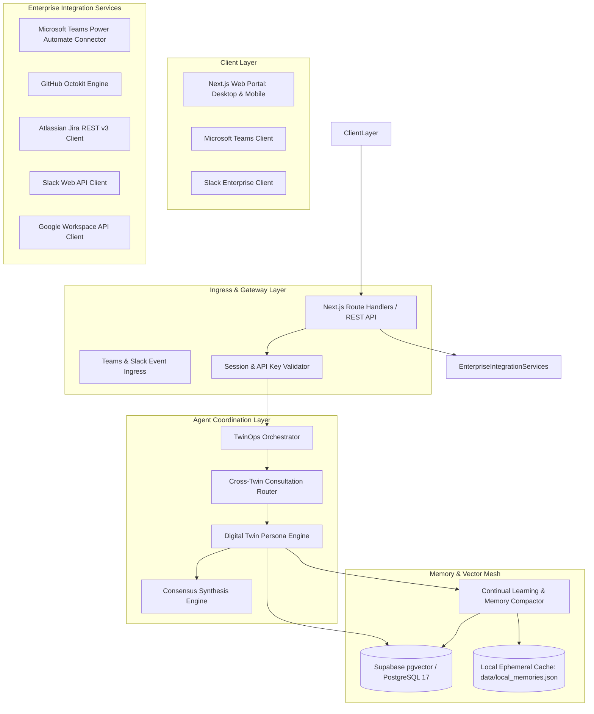

# System Architecture Specification

## 1. System Overview

TwinOps Enterprise is an operational intelligence and multi-agent coordination platform designed to synchronize organizational knowledge across enterprise collaboration suites (Microsoft Teams, GitHub, Jira, Slack, Notion, and Google Workspace). The platform deploys domain-specific digital twins that embody organizational knowledge, synthesize consensus across pods, and execute continual knowledge learning.

## 2. Core Architectural Components

### 2.1 Web Application & API Layer (Next.js 16 App Router)
- **Framework**: Next.js 16 with React 19 and Turbopack.
- **Role**: Serves the operator web portal (Executive Dashboard, Pod Network View, Clone Management, Knowledge Preservation) and exposes RESTful API endpoints under `/api/*`.
- **Streaming**: Server-Sent Events (SSE) for live token generation, multi-hop consultation traces, and citations.

### 2.2 Agent Coordination Layer
- **Clone Brain Engine** (`lib/agents/clone-brain.ts`): Dynamically constructs persona-specific system prompts from durable memories, past interactions, and verified workspace artifacts.
- **Consultation Router** (`lib/agents/collaboration.ts`): Implements dynamic OpenAI function-calling tools (`consult_clone`) enabling twin-to-twin peer querying. Enforces a maximum recursion depth of 2 hops and up to 3 consultations per turn to prevent unbounded loops.
- **Consensus Synthesis**: Aggregates divergent twin stances on architectural tickets, incident post-mortems, and pull requests to calculate confidence scores.

### 2.3 Knowledge & Memory Subsystem
- **Durable Relational Storage**: PostgreSQL 17 managed via Supabase, containing `clones` and unified `memories` tables.
- **Vector Search Engine**: `pgvector` extension utilizing 1536-dimensional cosine similarity embeddings (`match_memories` RPC).
- **Continual Learning Loop**: Extracts atomic facts and episodic interactions from user dialogues and webhooks asynchronously, scoring items with time-weighted recency bonuses and reinforcement counters.
- **Compaction Engine**: Consolidates raw episodic interactions into higher-order category summaries to control token usage during context injection.

### 2.4 Enterprise Connector Layer
- **Microsoft Teams**: Power Automate Workflows webhook integration formatting JSON Adaptive Cards (v1.4 standard) with interactive links and factsets.
- **GitHub**: Octokit-driven scanning engine extracting issues, pull requests, commit logs, and README documentation for semantic chunking.
- **Jira Cloud / DC**: REST API v3 client indexing project boards, sprint backlogs, and status transitions.
- **Slack**: Web API integration capturing channel messages and thread histories.
