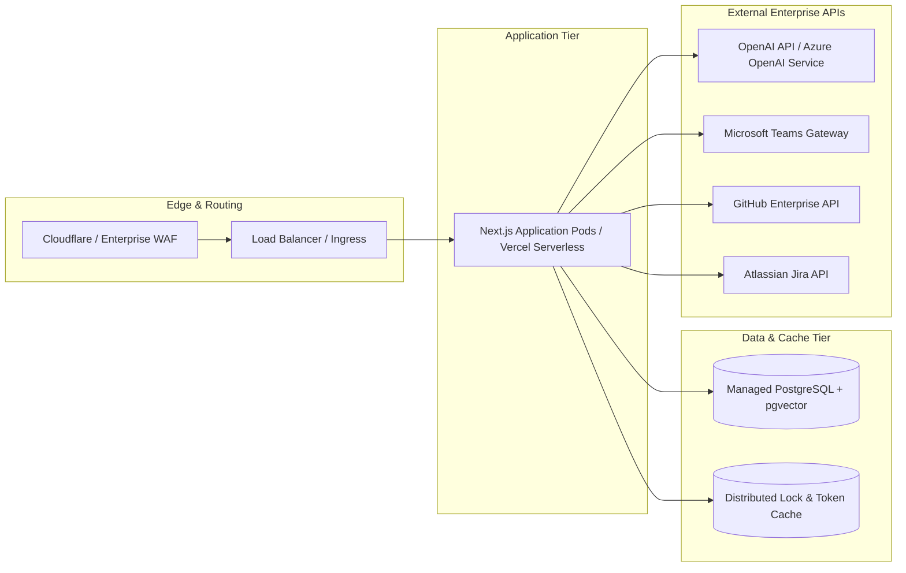

# Enterprise Deployment Guide

## 1. Production Architecture Overview

TwinOps is designed to run in modern cloud infrastructure supporting Node.js runtimes and managed PostgreSQL with vector extensions.



---

## 2. Deployment Targets

### Option A: Vercel Enterprise Deployment
Vercel is the native deployment target for Next.js:
1. Link GitHub repository to Vercel Enterprise project.
2. In Project Settings > Environment Variables, configure all variables listed in `.env.example`.
3. Set Node.js version to `20.x` or `22.x`.
4. Build Command: `npm run build`
5. Output Directory: `.next`

### Option B: Docker Container / Kubernetes Pods
For self-hosted enterprise clouds (AWS ECS, Azure Kubernetes Service, GCP Cloud Run):

```dockerfile
# Multi-stage enterprise Dockerfile
FROM node:20-alpine AS base

# Step 1: Install dependencies
FROM base AS deps
RUN apk add --no-cache libc6-compat
WORKDIR /app
COPY package.json package-lock.json ./
RUN npm ci

# Step 2: Build source
FROM base AS builder
WORKDIR /app
COPY --from=deps /app/node_modules ./node_modules
COPY . .
ENV NEXT_TELEMETRY_DISABLED 1
ENV NODE_ENV production
RUN npm run build

# Step 3: Minimal production runtime
FROM base AS runner
WORKDIR /app
ENV NODE_ENV production
ENV NEXT_TELEMETRY_DISABLED 1

RUN addgroup --system --gid 1001 nodejs
RUN adduser --system --uid 1001 nextjs

COPY --from=builder /app/public ./public
COPY --from=builder --chown=nextjs:nodejs /app/.next/standalone ./
COPY --from=builder --chown=nextjs:nodejs /app/.next/static ./.next/static

USER nextjs
EXPOSE 3000
ENV PORT 3000
ENV HOSTNAME "0.0.0.0"

CMD ["node", "server.js"]
```

---

## 3. Database Migration and pgvector Initialization

Production deployments require a managed PostgreSQL instance with the `vector` extension enabled.

### Migration Runbook
1. Ensure the PostgreSQL user has `CREATE EXTENSION` privileges.
2. Execute migration script:
   ```bash
   npx supabase db push --db-url "postgresql://postgres:[PASSWORD]@[HOST]:[PORT]/[DATABASE]"
   ```
3. Verify table schema and indexes:
   ```sql
   SELECT table_name FROM information_schema.tables WHERE table_schema = 'public';
   -- Expected tables: clones, memories, documents, sync_state
   ```

---

## 4. Production Environment Checklist

Before traffic routing is enabled, verify all required environment variables:

| Variable | Classification | Verification Method |
| :--- | :--- | :--- |
| `NEXT_PUBLIC_SUPABASE_URL` | Public / Non-secret | HTTPS URL accessible from browser |
| `NEXT_PUBLIC_SUPABASE_ANON_KEY` | Public / Low risk | JWT token with anon role |
| `SUPABASE_SERVICE_ROLE_KEY` | Secret / Critical | Secure Vault injection; bypasses RLS |
| `OPENAI_API_KEY` | Secret / Critical | Validated via `/api/health` connectivity |
| `TEAMS_WEBHOOK_URL` | Secret / Confidential | HTTPS endpoint on `office.com` or Azure |
| `GITHUB_TOKEN` | Secret / Confidential | Scoped GitHub Personal Access Token |
| `JIRA_API_TOKEN` | Secret / Confidential | Base64 encoded auth string |

---

## 5. Health Checks and Monitoring

### Liveness and Readiness Probes
- **Liveness Probe**: `GET /api/health`
  - Returns HTTP 200 `{ status: "ok", timestamp: ... }` when the Node.js process is responsive.
- **Readiness Probe**: `GET /api/health?detailed=true`
  - Checks database connection pool and vector store responsiveness.

### Logging Policy
Production logs must:
- Use structured JSON output.
- Include request tracing IDs (`x-request-id`).
- Strictly redact all tokens, Bearer headers, passwords, and sensitive context.

---

## 6. Rollback and Disaster Recovery

### Application Rollback
- In Vercel: Instant rollback to prior deployment hash via Dashboard or CLI.
- In Kubernetes: `kubectl rollout undo deployment/twinops-app`.

### Database Backup
- Enable automated point-in-time recovery (PITR) with a minimum 7-day retention window.
- Perform daily cold snapshots of the `memories` and `documents` tables.
